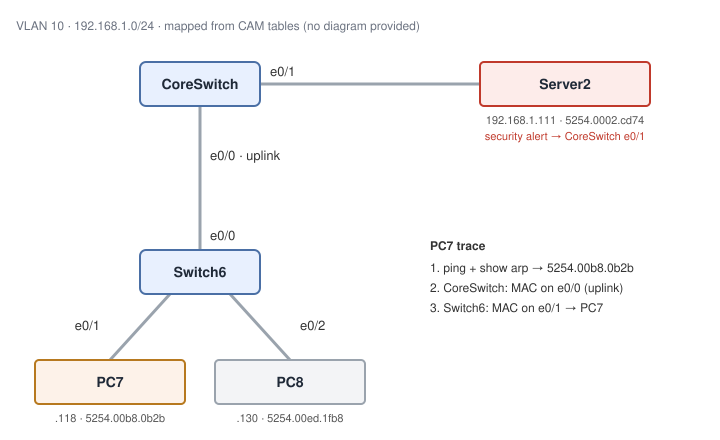

# Tracking Devices with the CAM Table: IP Ticket to Switch Port

**Platform:** Cisco CML (IOS-XE: a core switch and an access switch), from the NetworkChuck Academy *Fall into CCNA* cohort, Skill 6 Lesson 05 lab. The lab ran in a browser emulator, so there is no `.pka` file. This was a read-only investigation with no diagram provided; the topology below was mapped from switch output alone. All output is in [configs/verification.txt](configs/verification.txt).

## What it covers

Two tickets arrived with nothing but an IP address: a user at `192.168.1.118` reporting slow service, and a server at `192.168.1.111` flagged by security for containment. Using only switch access, the job was to find the exact switch and port for each device, so a field tech could walk to the right cable without guessing or unplugging anything.

**Method:** ping the IP from the core (which forces ARP) → `show arp` to turn the IP into a MAC → `show mac address-table` to find the port that MAC was learned on → if that port is the uplink, repeat on the next switch down → stop at the first access port.

| Ticket | IP | MAC | Trace | Location |
|---|---|---|---|---|
| Slow user (PC7) | `192.168.1.118` | `5254.00b8.0b2b` | CoreSwitch Et0/0 (uplink) → Switch6 Et0/1 | **Switch6 Et0/1** |
| Security alert (Server2) | `192.168.1.111` | `5254.0002.cd74` | CoreSwitch Et0/1 | **CoreSwitch Et0/1** |

## Skills demonstrated

- Turning an IP into a MAC from the switch side with `ping` + `show arp | include <ip>`
- Filtering the CAM table with `show mac address-table address <mac>`
- Hop-by-hop MAC tracing across an inter-switch link in a collapsed-core design
- Reading a CAM table to infer topology: a port with several MACs behind it, including another switch's `aabb.cc…` interface MAC, is an uplink, not an endpoint
- Telling an endpoint's real port apart from where it merely *appears*: Server2's MAC shows up on Switch6 Et0/0 too, because every switch learns a MAC on the port facing toward it

## Verification

| Completion check | Result |
|---|---|
| MAC-to-port mapping for `192.168.1.118` | ✅ ARP → `5254.00b8.0b2b`, on CoreSwitch Et0/0 (uplink), then on Switch6 Et0/1 (confirmed twice with the filtered lookup) |
| MAC-to-port mapping for `192.168.1.111` | ✅ ARP → `5254.0002.cd74`, on CoreSwitch Et0/1 (filtered lookup) |
| Exact switch/port in the notes | ✅ PC7 = Switch6 Et0/1, Server2 = CoreSwitch Et0/1 |
| Used ARP + CAM lookups despite PC8's extra entries | ✅ PC8's MAC (`5254.00ed.1fb8`, Switch6 Et0/2) was in both tables and correctly ignored |

**Not captured:** `show interface description` on either switch, so the device names (PC7, Server2, PC8) come from the ticket rather than port descriptions. PC8's MAC is identified by elimination (the only remaining endpoint MAC), not by ARP.

## Troubleshooting notes

1. **Host commands don't work on IOS.** My first three attempts were `apr -a 5 192.168.1.118` (a typo), then `arp -a 5 192.168.1.118`, and all returned `% Invalid input detected at '^' marker`. `arp -a` is the Windows/Linux command I'd just used on the PCs in the previous lab. On IOS, the ARP table is a show command: `show arp` (or `show ip arp`), filtered with `| include 192.168.1.118`. The caret lands *inside* the word `arp`, which tells you the parser didn't accept it as an EXEC command at all, so the `-a` flag was never the problem.
2. **Ping first, then read the ARP table.** The first probe of each ping timed out (`.!!!!`). That was CoreSwitch sending an ARP request and waiting for the reply before it could send the ICMP echo. Without that ping, `show arp` might have had no entry, or a stale one, for a host that hadn't talked recently. The `0` in the Age column confirms the entry was fresh.
3. **Don't stop at the first switch.** On CoreSwitch, PC7's MAC is on Et0/0, but so are PC8's MAC and another switch's `aabb.cc` MAC. Several MACs on one port means a downstream switch, not a device, so the trace has to continue on Switch6. The reverse applies too: Server2 shows up on Switch6 Et0/0 even though it's plugged into CoreSwitch.
