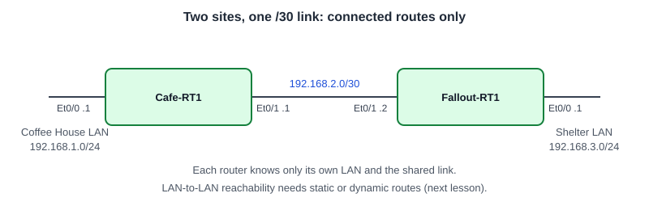

# Configuring Local Routing: Connected Routes Across a Point-to-Point Link

**Platform:** Cisco CML (IOS-XE router image), from the NetworkChuck Academy *Fall into CCNA* cohort, Skill 9 Lesson 02 lab. The lab ran in a browser emulator, so there is no `.pka` file. The commands and the captured output are in [configs/](configs/).

*Topology drawn from the lab brief; the cohort did not provide a diagram.*

## What it configures

Two site routers joined by a /30 point-to-point link, each with its own LAN. The goal is to address both ends, confirm each router lists its directly connected networks in the routing table, and prove the link with pings. No static or dynamic routing yet, so neither router knows the other site's LAN.

| Device | Port | Role | Address | Description |
|---|---|---|---|---|
| Cafe-RT1 | Et0/0 | Coffee House LAN | `192.168.1.1/24` | `## CoffeeHouse-LAN` |
| Cafe-RT1 | Et0/1 | Link to Fallout | `192.168.2.1/30` | `## P2P-to-Fallout` |
| Fallout-RT1 | Et0/0 | Shelter LAN | `192.168.3.1/24` | `## Fallout-LAN##` |
| Fallout-RT1 | Et0/1 | Link to Coffee House | `192.168.2.2/30` | `##P2P-to-CoffeeHouse##` |
| Fallout-RT1 | Et0/2 | Spare | shut down | preloaded label |

## Skills demonstrated

- Addressing routed interfaces, including a /30 (`255.255.255.252`) for a two-host link
- Reading `show ip route connected`: `C` for the connected network, `L` for the router's own /32 address
- Matching subnet masks on both ends of a link
- Recovering from addresses applied to the wrong interfaces
- Verifying with `show ip interface brief`, `show interfaces description` and `ping`

## Verification

| Completion check | Result |
|---|---|
| Cafe-RT1 lists `192.168.1.0/24` and `192.168.2.0/30` as connected | ✅ `C 192.168.1.0/24` on Et0/0 and `C 192.168.2.0/30` on Et0/1 |
| Cafe-RT1 Et0/1 up/up with the point-to-point address | ✅ `192.168.2.1`, up/up, labelled `## P2P-to-Fallout` |
| Fallout-RT1 lists `192.168.3.0/24` and `192.168.2.0/30` as connected | ✅ `C 192.168.3.0/24` on Et0/0 and `C 192.168.2.0/30` on Et0/1 |
| Fallout-RT1 link active and labelled | ✅ Et0/1 up/up, `##P2P-to-CoffeeHouse##`; Et0/2 still shut |
| Pings across the /30 succeed from both routers | ✅ Cafe-RT1 to `.2`: 5/5. Fallout-RT1 to `.1`: 5/5 |
| Configurations saved | ✅ `write memory` on both routers after the final change |

**Not captured:** a ping from Fallout-RT1 after Cafe-RT1's mask was corrected to /30. Fallout's 5/5 was taken while Cafe-RT1 still had a /24 on the link (see note 3). Cafe-RT1's final 5/5 was taken after the fix.

**Expected at this stage:** neither routing table has the other site's LAN, so LAN-to-LAN traffic would fail. That is the next lesson (static routes).

## Troubleshooting notes

1. **Addresses on the wrong interfaces.** On Cafe-RT1 I put the link address `192.168.2.1` on Et0/0 and the LAN address `192.168.1.1` on Et0/1. Both ports showed up/up, but the ping to `192.168.2.2` failed 0/5 twice, and Fallout-RT1's first ping failed too. `show ip route connected` gave it away: `192.168.2.0` was listed on Et0/0, the LAN port. Up/up only proves the cable; it says nothing about which network is on it.
2. **`% 192.168.1.0 overlaps with Ethernet0/1`.** I tried to fix it by typing the right address on each port in turn. IOS refused both, because a router will not put the same subnet on two interfaces, and it kept the old addresses. Fix: `no ip address` on both interfaces first, then apply the correct ones. `show ip interface` confirmed both were cleared (`Internet protocol processing disabled`) before I re-applied them.
3. **Mask mismatch that a ping does not catch.** After the swap was fixed, Cafe-RT1's link still had `255.255.255.0` while Fallout-RT1 had `255.255.255.252`. The ping worked anyway, 4/5, because `.1` and `.2` fall inside both a /24 and a /30. I caught it when checking the route table against the brief: Cafe-RT1 listed `192.168.2.0/24` where Fallout-RT1 listed `192.168.2.0/30`. Fix: re-enter the address with the /30 mask. Left alone, Cafe-RT1 would have treated 252 addresses that are not on the link as directly connected.
4. **Reading "variably subnetted".** The route table header says `192.168.2.0/24 is variably subnetted, 2 subnets, 2 masks` even when the connected route is a /30. That header is the classful parent network; the masks that matter are on the `C` and `L` lines under it.
5. **IOS accepted `192.0168.3.1`.** A typo on Fallout-RT1, taken as `192.168.3.1`. `show ip interface brief` confirmed the address was right.
6. **`show` and `wr` do not work in config mode.** They failed from `(config)#` and `(config-if)#`; they need `do` in front, or a return to the `#` prompt. The reverse also fails: `do show ip interface brief` at the `#` prompt is invalid, because `do` only exists in config mode.
7. **`line` is not for interfaces.** I tried `line interface ethernet 0/0` and several variations. `line` configures console and VTY lines; a port is entered with `interface ethernet 0/0`.
