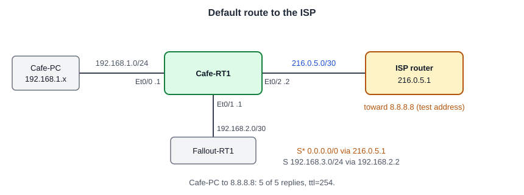

# Configuring Default Routing: ISP Uplink and a Gateway of Last Resort

**Platform:** Cisco CML (IOS-XE router image + Tiny Core Linux PC), from the NetworkChuck Academy *Fall into CCNA* cohort, Skill 9 Lesson 04 lab. The lab ran in a browser emulator, so there is no `.pka` file. The commands and the captured output are in [configs/](configs/).

*Topology drawn from the lab brief; the cohort did not provide a diagram.*

## What it configures

The Coffee House router already reaches its own LAN and the Fallout site (see [Configuring Static Routing](../static-routing-two-sites/)). This lab adds the internet side: address the ISP-facing port, then install a default route so any destination the router has no specific route for is sent to the provider.

| Device | Port | Role | Address |
|---|---|---|---|
| Cafe-RT1 | Et0/0 | Coffee House LAN | `192.168.1.1/24` |
| Cafe-RT1 | Et0/1 | Link to Fallout | `192.168.2.1/30` |
| Cafe-RT1 | Et0/2 | ISP uplink, `##ISP-Uplink` | `216.0.5.2/30` |
| ISP router | | Next hop | `216.0.5.1` |
| Cafe-PC | Coffee House LAN | Test host | on `192.168.1.0/24` |

Default route added: `ip route 0.0.0.0 0.0.0.0 216.0.5.1`

## Skills demonstrated

- Addressing a WAN interface with an ISP-assigned /30 and bringing it up
- Testing the next hop before pointing a route at it
- Default static route (`0.0.0.0/0`) and reading `Gateway of last resort`
- Reading `S*` in the routing table: a static route that is the candidate default
- Testing from a LAN host, so the packet is actually routed

## Verification

| Completion check | Result |
|---|---|
| Et0/2 carries the ISP address | ✅ `216.0.5.2`, up/up in `show ip interface brief` |
| ISP next hop reachable | ✅ ping `216.0.5.1`: 4/5 (first packet lost to ARP) |
| Default route points to the provider | ✅ `S* 0.0.0.0/0 [1/0] via 216.0.5.1` and `Gateway of last resort is 216.0.5.1 to network 0.0.0.0` |
| Cafe-PC reaches the external test address | ✅ `ping -c 5 8.8.8.8`: 5 of 5 received, 0% loss |
| Configuration saved | ✅ `wr` after the default route was added |

**Not captured:** the "before" test. The brief asks for a ping from Cafe-PC to `8.8.8.8` before the default route exists, to show it fail. I captured only the successful ping, so this write-up shows the result but not the before-and-after contrast. Also not captured: `show interfaces description` for the Et0/2 label.

## Notes from the lab

1. **Test the next hop first.** Before adding the route I pinged `216.0.5.1` from the router: 4/5. A static route pointing at an address the router cannot reach is not installed in the routing table, so this check comes first.
2. **`S*` and the gateway of last resort.** After the command, `show ip route static` listed `S* 0.0.0.0/0 [1/0] via 216.0.5.1`. The `*` marks the candidate default, and the header line changed from `is not set` to `is 216.0.5.1 to network 0.0.0.0`.
3. **The specific route still wins.** The table holds both `0.0.0.0/0` and `192.168.3.0/24 via 192.168.2.2`. Traffic for the Fallout LAN keeps using the /24, because the router picks the longest matching prefix. The default only catches what nothing else matches.
4. **`ttl=254` on the replies.** The replies from `8.8.8.8` arrived with a TTL of 254. Cisco routers send with 255, so the answer came from a device one router hop past Cafe-RT1. That fits the lab's ISP router answering for the test address, not the real public server.
5. **No NAT, and it still worked.** Cafe-PC has a private `192.168.1.x` address and the ping succeeded with no NAT on Cafe-RT1. That only works because the lab's ISP router knows a route back to `192.168.1.0/24`. On the real internet, private addresses are not routed, so this design would also need NAT.
6. **`216.05.2` was rejected.** I left out a dot, which gave IOS three octets: `% Invalid input detected`. Compare the previous lab, where `192.0168.3.1` still had four octets and was accepted.
7. **Console messages split my typing again.** `%PNP-6` messages printed while I typed `interface`, and link up/down messages printed over `end`. Nothing was lost. `logging synchronous` on the console line fixes the display.
