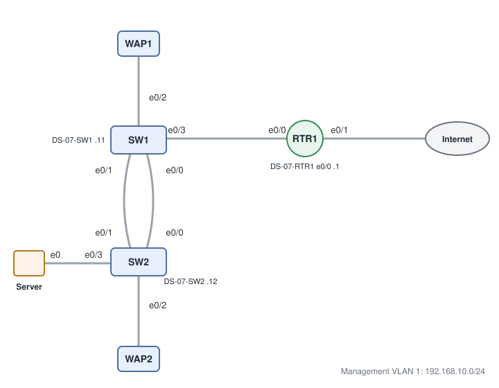

# District Shop Bring-Up: Base Hardening and Management Addressing

**Platform:** Cisco CML (IOS-XE 17.16.1a switch and router images), from the NetworkChuck Academy *Fall into CCNA* cohort, Skill 5 lab. The lab ran in a browser emulator, so there is no `.pka` file. The saved configs in [configs/startup-configs.txt](configs/startup-configs.txt) let you rebuild it.

## What it configures

A new small site with two access switches, one edge router, two WAPs and a server. All three network devices go from factory state to a hardened baseline that can be managed on `192.168.10.0/24`.

| Device | Role | Management IP | Gateway |
|---|---|---|---|
| DS-07-SW1 | Access switch, uplink to router on e0/3, SW2 on e0/0-1, WAP1 on e0/2 | Vlan1 `192.168.10.11/24` | `192.168.10.1` |
| DS-07-SW2 | Access switch, SW1 on e0/0-1, WAP2 on e0/2, server on e0/3 | Vlan1 `192.168.10.12/24` | `192.168.10.1` |
| DS-07-RTR1 | Edge router, inside interface e0/0 | e0/0 `192.168.10.1/24` | n/a |

Every device gets a hostname, the MOTD warning banner, an enable secret, `service password-encryption`, console and VTY passwords enforced with `login`, VTY limited to SSH, and port descriptions.

## Skills demonstrated

- Setting device identity with `hostname` and `banner motd`
- Protecting privileged access with `enable secret`, and encrypting line passwords (type 7) with `service password-encryption`
- Securing console and VTY lines with `password` + `login`, and `transport input ssh` on VTY
- Documenting ports with `description` on uplinks, the inter-switch link, and WAP/server drops
- Management SVI (`interface vlan1`) and `ip default-gateway` on Layer 2 switches
- Addressing a router interface and bringing it up with `no shutdown`
- Config lifecycle: comparing running and startup, `write memory`, and proving the config survives a reload

## Verification

The full output is in [configs/verification.txt](configs/verification.txt).

| Completion check | Result |
|---|---|
| Prompts read `DS-07-*` and the banner shows on connect | ✅ Banner shown at login after the SW1 reload |
| Enable secret hashed | ✅ Stored as **type 9** (scrypt). The lab expected type 5, but IOS-XE 17.16 uses type 9 by default, which is stronger. |
| Line passwords encrypted | ✅ `password 7 …` on console and VTY on all three devices |
| SW1 / SW2 management interfaces up, gateway `192.168.10.1` | ✅ `Vlan1 192.168.10.11` / `.12`, up/up, plus `ip default-gateway 192.168.10.1` |
| Router inside interface | ✅ `Ethernet0/0 192.168.10.1` up/up, with description to SW1 e0/3 |
| Startup matches running | ✅ `startup-config is not present` before the save, then the full config after `write memory` on all three devices |
| Survives a reload with the passwords enforced | ✅ DS-07-SW1 reloaded, asked for the console password, then the enable secret |
| Management reachability | ✅ SW1 and SW2 both ping `192.168.10.1` (4/5; the first packet was lost to ARP) |

Not tested: an actual SSH session to the VTY lines. SSH would also need `ip domain-name`, RSA keys and a local user, which this lab doesn't cover.

## Troubleshooting notes

1. **Pasting a save command swallowed the next line.** I pasted `copy running-config startup-config` together with the verify commands. IOS stopped at `Destination filename [startup-config]?` and read the *next pasted line* as the filename: `%Error copying nvram:show (Invalid argument)`. Nothing was saved, and `show startup` confirmed `startup-config is not present`. **Fix:** saved with `write memory`, which doesn't prompt, and re-ran `show startup` to confirm. **Lesson:** interactive commands (`copy`, `reload`, `delete`) break pasted blocks. Run them on their own.
2. **Wrong interface names on the router** (first attempt). `interface g0/0` and `interface vlan1` returned `% Invalid input`. `do show ip interface brief` showed that this router only has `Ethernet0/0-3`, all administratively down, so I used `e0/0` to match the topology link to SW1 e0/3.
3. **CIDR notation is rejected** (first attempt). `ip address 192.168.10.11/24` fails. IOS wants a dotted-decimal mask: `ip address 192.168.10.11 255.255.255.0`.
4. **Pasting prompts into the console** (first attempt). Pasting text copied from another device's console, prompts included (`DS-07-SW1(config)#banner motd #`), makes every line fail. Lines starting with `#` are silently ignored, so the hostname never changed. Paste only the commands, and confirm the prompt changed before moving on.
