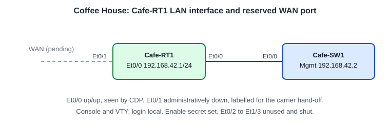

# Configuring Router Interfaces: Baseline Login, LAN Interface and a Reserved WAN Port

**Platform:** Cisco CML (IOS-XE router image), from the NetworkChuck Academy *Fall into CCNA* cohort, Skill 8 Lesson 02 lab. The lab ran in a browser emulator, so there is no `.pka` file. The commands and the captured output are in [configs/](configs/).

*Topology drawn from the lab brief and `show cdp neighbors`; the cohort did not provide a diagram.*

## What it configures

A branch router at a coffee house site: require a username and password on the console and VTY lines, set an enable secret, bring the LAN interface into service, and label the WAN port that is waiting on a carrier circuit.

| Device | Port | Role | Setting |
|---|---|---|---|
| Cafe-RT1 | Et0/0 | LAN, to Cafe-SW1 Et0/0 | `192.168.42.1/24`, up/up, description |
| Cafe-RT1 | Et0/1 | Future WAN hand-off | Administratively down, description |
| Cafe-RT1 | Et0/2 to Et1/3 | Unused | Administratively down, no description |
| Cafe-SW1 | Management | Ping target | `192.168.42.2` |

## Skills demonstrated

- Local authentication: `username ... secret`, with `login local` on the console and VTY lines
- `enable secret`, `logging synchronous` and `transport input ssh telnet`
- Addressing and enabling a routed interface (router ports are shut down by default)
- Documenting ports with `description` and reading them back with `show interfaces description`
- Verifying the neighbour with `show cdp neighbors` and reachability with `ping`
- Saving with `write memory` and checking the result in `show startup-config`

## Verification

| Completion check | Result |
|---|---|
| Et0/0 up/up with `192.168.42.1/24` | ✅ `show ip interface brief` |
| Ping to Cafe-SW1 (`192.168.42.2`) | ✅ 4/5 on the first try (first packet lost to ARP), then 5/5 |
| Et0/1 administratively down and labelled; other ports shut and unlabelled | ✅ `show interface description` |
| Console and VTY require the local username; enable secret set | ✅ `login local` appears twice in the running config, with `username cisco secret 9` and `enable secret 9` |
| Configuration saved | ✅ `write memory` after the interface work; both descriptions appear in `show startup-config` |

**Not tested:** logging out and back in to prove the login prompt and enable secret work, and a Telnet or SSH session to the VTY lines. The IP address line was not shown from the startup config (see note 5), though the save came after it was configured.

**Wording differences from the brief:** the brief asks for `## CoffeeHouse-LAN` and `## WAN-Pending`. Mine read `##CoffeHouse-LAN` (a typo, missing an "e") and `##Wan-Pending Shutdown##`.

**Platform difference:** the brief's era of IOS stores secrets as type 5 (MD5). This IOS-XE image stores `secret` passwords as type 9 (scrypt) by default.

## Troubleshooting notes

1. **`ex` works in one mode and not another.** In line config mode `ex` returned `% Ambiguous command`, because it matches `exit` and the `exec` commands (`exec-timeout` and others). In interface config mode the same `ex` worked. Abbreviations only need to be unique within the current mode, so `exit` or `end` is the safe habit.
2. **`show interface status` is a switch command.** `show ip interface status` and `ip interface status` both failed on the router. For a one-line-per-port view with labels, a router uses `show interfaces description`; for addresses and state, `show ip interface brief`.
3. **CDP found the switch.** The brief warns the switch may not appear as a neighbour. Here `show cdp neighbors` listed `Cafe-SW1` on local Et0/0, port Et0/0, which confirmed the cabling before the ping.
4. **Et0/1 needed no `shutdown`.** Router interfaces start administratively down, so labelling it was enough. That is the opposite of a switch, where ports come up on their own.
5. **Two commands pasted on one line.** I pasted `show startup-config | include description| ip addresss ping 192.168.42.2` as a single line. Everything after `include` became the search pattern, so the output showed only the description lines, the IP address line never matched (the stray space and the extra "s"), and the ping did not run. I ran the ping again on its own line: 5/5.
6. **Syntax IOS rejected.** `vty 0 4` without `line`, `ip address 192.168.42` (incomplete address), `noshutdown` without the space, and `interface etherenet 0/1`.
