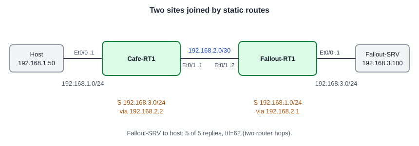

# Configuring Static Routing: Joining Two Site LANs Across a /30 Link

**Platform:** Cisco CML (IOS-XE router image + Tiny Core Linux server), from the NetworkChuck Academy *Fall into CCNA* cohort, Skill 9 Lesson 03 lab. The lab ran in a browser emulator, so there is no `.pka` file. The commands and the captured output are in [configs/](configs/).

*Topology drawn from the lab brief; the cohort did not provide a diagram.*

## What it configures

Two site routers share a /30 point-to-point link, and each knows only its own LAN. One static route on each router tells it how to reach the other site's LAN, so hosts on both sides can talk. This follows on from [Configuring Local Routing](../connected-routes-two-routers/), where the same routers had connected routes only.

| Device | Port | Address | Static route added |
|---|---|---|---|
| Cafe-RT1 | Et0/0 (LAN) | `192.168.1.1/24` | `192.168.3.0/24` via `192.168.2.2` |
| Cafe-RT1 | Et0/1 (link) | `192.168.2.1/30` | |
| Fallout-RT1 | Et0/0 (LAN) | `192.168.3.1/24` | `192.168.1.0/24` via `192.168.2.1` |
| Fallout-RT1 | Et0/1 (link) | `192.168.2.2/30` | |
| Fallout-SRV | Shelter LAN | `192.168.3.100` | |
| Coffee House host | Coffee House LAN | `192.168.1.50` | |

## Skills demonstrated

- Checking the baseline first: interfaces up/up and connected routes present before adding anything
- `ip route <network> <mask> <next-hop>` with a next-hop address on the shared link
- Reading a static entry: `S 192.168.3.0/24 [1/0] via 192.168.2.2` (administrative distance 1, metric 0)
- Routing must work in both directions: one static route per router
- Testing from a real host, not only from the router

## Verification

| Completion check | Result |
|---|---|
| Cafe-RT1 has a static route to `192.168.3.0/24` via `192.168.2.2` | ✅ `S 192.168.3.0/24 [1/0] via 192.168.2.2` |
| Fallout-RT1 has a static route to `192.168.1.0/24` via `192.168.2.1` | ✅ `S 192.168.1.0/24 [1/0] via 192.168.2.1` |
| Router-to-server ping succeeds | ✅ Cafe-RT1 to `192.168.3.100`: 5/5 |
| Fallout-SRV to Coffee House host ping succeeds | ✅ `192.168.1.50`: 5 of 5 received, 0% loss, `ttl=62` |
| Configurations saved | ✅ `wr` on both routers after the route was added |

**Not captured:** the full `show ip route` after the change (only the `static` filter), and a `traceroute` showing the hop-by-hop path.

## Notes from the lab

1. **The router's ping did not prove both routes.** Cafe-RT1's ping to the server leaves from its link address, `192.168.2.1`. Fallout-RT1 is directly connected to that network, so the reply gets back even without Fallout's static route. The test that needs both routes is the host one: Fallout-SRV (`192.168.3.100`) to the Coffee House host (`192.168.1.50`). The request needs Fallout-RT1's route to `192.168.1.0/24`, and the reply needs Cafe-RT1's route to `192.168.3.0/24`. That ping returned 5 of 5.
2. **`ttl=62` confirms the path.** The replies arrived with a TTL of 62. A Linux host sends with 64, and each router takes one off, so the reply crossed two routers: Cafe-RT1 and Fallout-RT1.
3. **Console messages landed in the middle of my typing.** On both routers, `%PNP-6` and `%SYS-5-CONFIG_P` log messages printed while I was typing `ip route`, splitting the command across several lines on screen. Nothing was lost; the router still had the characters, and the full command went in on the next attempt. `logging synchronous` on the console line makes IOS reprint the half-typed command after a message.
4. **Why a next-hop address.** Both routes point at the neighbour's address on the /30 (`192.168.2.2` and `192.168.2.1`). Each router already has that /30 as a connected route, so it knows which interface to use to reach the next hop.
5. **Baseline first.** Before adding anything, `show ip interface brief` and `show ip route` on both routers confirmed the LAN and link interfaces were up/up with the right addresses, including the /30 on both ends of the link.
