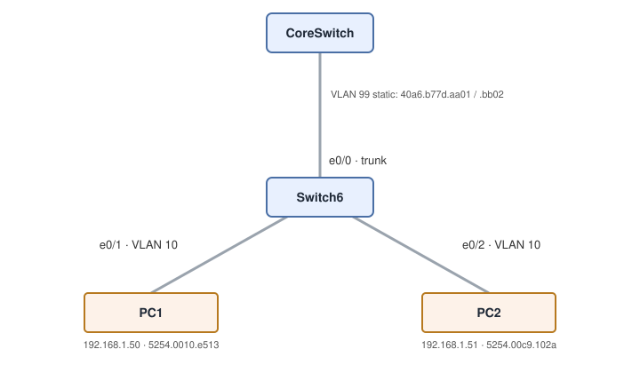

# Exploring Switch CAM Tables: Watching a Switch Learn MACs

**Platform:** Cisco CML (IOS-XE L2 switch image, Tiny Core Linux endpoints), from the NetworkChuck Academy *Fall into CCNA* cohort, Skill 6 Lesson 04 lab. The lab ran in a browser emulator, so there is no `.pka` file. This lab generated traffic and inspected tables, so there is no saved config. All output is in [configs/verification.txt](configs/verification.txt).

## What it covers

Two Linux workstations share VLAN 10 on Switch6, which has a trunk uplink to a core switch on VLAN 99. The goal was to generate ARP and ICMP traffic between the PCs, watch the switch's MAC address table (CAM table) learn their addresses on the right ports, then flush the dynamic entries and let traffic rebuild them.

| Device | IP | MAC | Switch6 port |
|---|---|---|---|
| PC1 | `192.168.1.50/24`, gateway `.1` | `52:54:00:10:E5:13` | Et0/1 (VLAN 10) |
| PC2 | `192.168.1.51/24`, gateway `.1` | `52:54:00:C9:10:2A` | Et0/2 (VLAN 10) |
| CoreSwitch uplink | n/a | `40a6.b77d.aa01` / `.bb02` (static) | Et0/0 (VLAN 99) |

## Skills demonstrated

- Checking endpoint addressing on Linux with `ifconfig eth0` and `route -n`
- ARP resolution: an empty `arp -a`, then the first ping paying the ARP cost, then the cache populated
- Reading `show mac address-table` and matching each switch entry to a host MAC. Note the formats differ: Linux `52:54:00:10:E5:13` is Cisco `5254.0010.e513`.
- Telling DYNAMIC (learned from traffic) entries apart from STATIC (configured) ones
- `clear mac address-table dynamic`: flushes learned entries only; static entries survive

## Verification

| Completion check | Result |
|---|---|
| PCs have the correct static IPs | ✅ PC1 `.50/24`, PC2 `.51/24`, both with default gateway `192.168.1.1` |
| ARP caches reveal each other | ✅ PC1: empty before the ping, `192.168.1.51 at 52:54:00:c9:10:2a` after. The first ping took 1.56 ms and the rest about 0.95 ms (the ARP exchange). ⚠️ PC2's `arp -a` wasn't captured. |
| CAM table maps PC1, PC2 and the uplink | ✅ `5254.0010.e513` on Et0/1 and `5254.00c9.102a` on Et0/2, both matching the MACs from `ifconfig`. The uplink statics are on Et0/0 in VLAN 99. |
| Clear and re-learn without manual intervention | ✅ `clear mac address-table dynamic` ran, and all 4 static entries survived. Both dynamic entries were already back in the very next `show`, re-learned from live traffic. The empty-table moment wasn't captured (see note 1). |

## Troubleshooting notes

1. **The cleared entries came back before I could show the empty table.** I spent about 15 minutes on this one. Every time I ran `clear mac address-table dynamic` and then `show mac address-table`, both PC entries were still there, so it looked like the clear wasn't working. The cause was that PC1 traffic was still flowing, and the switch re-learned the MACs faster than I could run the next command. That isn't a failure: a switch learns the source MAC of *every* frame it receives, so any frame from PC1 or PC2 re-creates the entry within milliseconds. The static entries stayed, which confirms that `clear ... dynamic` only removes learned entries. **To capture the empty table:** stop all traffic first (`Ctrl+C` any running ping), then paste `clear mac address-table dynamic` and `show mac address-table` as a pair. `clear` doesn't prompt, so both lines run back to back.
2. **The re-run ping had no ARP delay.** After the flush, PC1's second ping averaged 0.94 ms, with no slow first packet. Clearing the switch's CAM table has no effect on the PC's ARP cache. The CAM table (MAC to port, on the switch) and the ARP cache (IP to MAC, on the host) are separate tables on separate devices. To see the ARP delay again, you'd clear the host's entry (`arp -d 192.168.1.51` on Linux).
3. **`ifconfig eht0` returned "Device not found".** It was a typo, but the error is worth knowing: Linux reports a missing interface name the same way whether it's misspelled or doesn't exist. `ifconfig -a` (or `ip link`) lists the real names before you query one.
