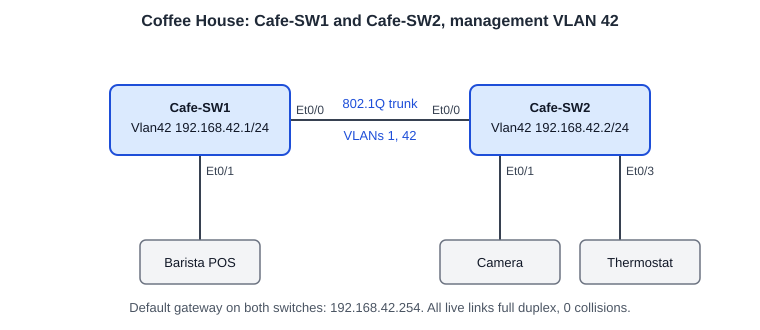

# Switch Duplex and Management IP: Trunk, VLAN 42 SVIs and Gateway

**Platform:** Cisco CML (IOS-XE 17.16 L2 switch image), from the NetworkChuck Academy *Fall into CCNA* cohort, Skill 8 Lesson 01 lab. The lab ran in a browser emulator, so there is no `.pka` file. The full configuration and all verification output are in [configs/](configs/).

## What it configures

Two access switches at a coffee house site, taken from factory state to a labelled, trunked and manageable baseline.

| Device | Port | Role | Setting |
|---|---|---|---|
| Cafe-SW1 | Et0/0 | Uplink to Cafe-SW2 | 802.1Q trunk, VLANs 1 and 42 allowed |
| Cafe-SW1 | Et0/1 | BaristaPOS | Full duplex |
| Cafe-SW1 | Et0/2 | Cam01 | Full duplex |
| Cafe-SW1 | Et0/3 | Thermostat | Full duplex |
| Cafe-SW1 | Vlan42 | Management SVI | `192.168.42.1/24` |
| Cafe-SW2 | Et0/0 | Uplink to Cafe-SW1 | 802.1Q trunk, VLANs 1 and 42 allowed |
| Cafe-SW2 | Et0/1 | Cam01 | Full duplex |
| Cafe-SW2 | Et0/2 | Cam02 | Full duplex |
| Cafe-SW2 | Et0/3 | Thermostat | Full duplex |
| Cafe-SW2 | Vlan42 | Management SVI | `192.168.42.2/24` |

Both switches also have a hostname, an MOTD banner, an enable secret, `service password-encryption`, console and VTY passwords with SSH-only VTY, and default gateway `192.168.42.254`.

## Skills demonstrated

- Labelling interfaces with `description` so port roles can be read from `show interface status`
- Setting duplex explicitly with `duplex full`, and checking link health from the error counters
- Building an 802.1Q trunk: `switchport trunk encapsulation dot1q`, `switchport mode trunk`, and `switchport trunk allowed vlan add 42`
- Management VLAN and SVI (`interface vlan42`) with a default gateway
- Proving reachability across the trunk on the management VLAN

## Verification

| Completion check | Result |
|---|---|
| Descriptions on the uplink, POS, camera and thermostat ports | Yes. `show interface status` on both switches |
| Full duplex with zero collisions on the live links | Yes. 0 output errors, 0 collisions, 0 late collisions on all three live ports of each switch |
| Trunk carries VLAN 42 | Yes. Et0/0 is `trunking` with VLANs 1,42 allowed, active and forwarding on both ends |
| Ping between `192.168.42.1` and `192.168.42.2` | Yes. 4/5 from each side. The first packet was lost to ARP. |
| Management SVIs up/up | Yes. `Vlan42` is up/up on both switches |

Not tested: an SSH session to the SVIs. The lab configures `transport input ssh` but does not cover RSA keys, a domain name or a local user.

## Troubleshooting notes

1. **Check negotiated duplex, not just the config.** `show interface status` reports duplex and speed on one line per port, so a mismatch shows up at a glance. Then confirm with the error counters under `show interface`: late collisions on a full-duplex port point to a half-duplex neighbour on the other end. Here all three live ports on each switch were full duplex with zero collisions.
2. **A trunk can be up and still not carry your VLAN.** `show interface trunk` has three lists per trunk port: allowed, active in the management domain, and forwarding. VLAN 42 was created on both switches before the allowed list was changed, and it appeared in all three lists on both ends. If a VLAN is allowed but missing from the active list, it was never created on that switch.
3. **The emulator's speed column does not prove negotiation.** It shows `auto` and 10/100/1000BaseTX on every port, including the shut ones. On physical Cisco Catalyst hardware, a negotiated link shows an `a-` prefix (`a-full`, `a-1000`).
