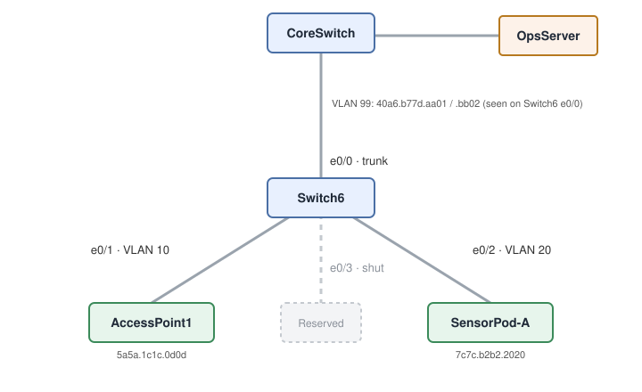

# Switch Interfaces and the CAM Table: Reading What's on Each Port

**Platform:** Cisco CML (IOS-XE L2 switch image), from the NetworkChuck Academy *Fall into CCNA* cohort, Skill 6 Lesson 02 lab. The lab ran in a browser emulator, so there is no `.pka` file. This was a read-only audit, so nothing was configured. All show output is in [configs/verification.txt](configs/verification.txt).

## What it covers

An audit of an aggregation switch, Switch6, using only show commands. The goal was to identify every port's role, check link health (duplex, speed, errors), and use the MAC address table (CAM table) to find where each device connects and which port leads to another switch.

| Port | Description | VLAN | State | Connects to |
|---|---|---|---|---|
| Et0/0 | Uplink-to-CoreSwitch | trunk | up/up | CoreSwitch (OpsServer behind it) |
| Et0/1 | AccessPoint1 | 10 | up/up | AccessPoint1 (`5a5a.1c1c.0d0d`) |
| Et0/2 | SensorPod-A | 20 | up/up | SensorPod-A (`7c7c.b2b2.2020`) |
| Et0/3 | Reserved-StackLink | 1 | admin down | Unused, shut |

## Skills demonstrated

- `show ip interface brief`: fast up/down roll call, including telling *administratively down* (shut on purpose) apart from a down link
- `show interface status`: duplex, speed, VLAN and trunk status on one line per port
- `show interface description`: mapping ports to cable runs without tracing wires
- `show interface`: reading the error counters (CRC, input/output errors, collisions, late collisions) that point to a duplex mismatch or bad cabling
- `show mac address-table` and `show mac address-table address <mac>`: finding a device's port from its MAC, telling static entries from dynamic ones, and spotting an uplink by the multiple MACs behind it

## Verification

| Completion check | Result |
|---|---|
| Interface summary confirms Et0/0–Et0/3 | ✅ Et0/0–0/2 up/up, Et0/3 administratively down |
| Full duplex, healthy links on the uplink, AP and sensor | ✅ All `full` / `auto`. No port dropped to half duplex or locked at 10 Mbps. Nothing needed flagging. |
| Link health beyond the status line | ✅ `show interface`: 0 input errors, 0 CRC, 0 output errors and 0 collisions on every port |
| CAM table pinpoints each device | ✅ AP `5a5a.1c1c.0d0d` on Et0/1 (VLAN 10), sensor `7c7c.b2b2.2020` on Et0/2 (VLAN 20), and the filtered lookup confirms the AP on Et0/1 |
| Identify the port that backhauls to the core | ✅ Et0/0 is the only trunk, and it carries two MACs in VLAN 99 (CoreSwitch and OpsServer) |

**Caveat:** the two uplink MACs on Et0/0 are *static* entries preloaded by the lab to simulate a switch-to-switch link. In a live network, those would be dynamic entries learned from traffic crossing the trunk. The only dynamically learned MACs here are the `5254.xxxx` addresses on the AP and sensor ports.

## Troubleshooting notes

1. **`show interface brief` isn't an IOS command.** My first two attempts were `show interfance brief` (a typo) and `show interface brief`, and both returned `% Invalid input detected at '^' marker`. The `^` marks where the parser gave up: on `brief`, not `interface`. `show interface brief` is NX-OS syntax. On IOS, the concise roster is `show ip interface brief`. I fell back to plain `show interface` first, which prints the full detail for every port. That turned out to be useful, because it's the only view with the error counters that confirm the links are clean.
2. **Descriptions get truncated in `show interface status`.** The Name column is 18 characters wide, so `Uplink-to-CoreSwitch` shows as `Uplink-to-CoreSwit`. Use `show interface description` for the full text. If you write descriptions with the key word first (for example `Core-Uplink`), they still read clearly in the status view.
3. **`full / auto` shows up even on a shutdown port.** Et0/3 is disabled but reports exactly the same `full auto` as the live ports. This emulator image prints fixed values rather than negotiated results. On a physical Catalyst, a negotiated link shows an `a-` prefix (`a-full`, `a-1000`), and that prefix is what proves auto-negotiation worked. The error counters in `show interface` were the stronger health evidence here.
