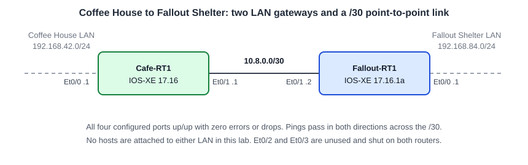

# Two-Router Interface Activation: LAN Gateways and a /30 Point-to-Point Link

**Platform:** Cisco CML (IOS-XE 17.16.1a), from the NetworkChuck Academy *Fall into CCNA* cohort, Skill 8 Skill Lab 01. The lab ran in a browser emulator, so there is no `.pka` file. The commands and the captured output are in [configs/](configs/).

*Topology drawn from the lab brief and the interface output; the cohort did not provide a diagram.*

## What it configures

Two site routers arrive staged with credentials and port labels, but with every port shut down. The job is to check that both meet the security standard, bring up each site's LAN gateway, light the link between the two sites, and prove it all with output.

| Device | Port | Role | Setting |
|---|---|---|---|
| Cafe-RT1 | Et0/0 | Coffee House LAN gateway | `192.168.42.1/24`, up/up |
| Cafe-RT1 | Et0/1 | Point-to-point to Fallout-RT1 | `10.8.0.1/30`, up/up |
| Fallout-RT1 | Et0/0 | Fallout Shelter LAN gateway | `192.168.84.1/24`, up/up |
| Fallout-RT1 | Et0/1 | Point-to-point to Cafe-RT1 | `10.8.0.2/30`, up/up |
| Both | Et0/2, Et0/3 | Unused | Administratively down |

## Skills demonstrated

- Auditing a delivered config against a security standard: type 9 secrets, `login local` on console, aux and VTY, `login on-success log`
- Addressing and enabling routed interfaces without disturbing their existing descriptions
- /30 subnetting: network, two usable hosts, broadcast
- Reading `show ip interface brief`, `show interfaces description`, `show ip route connected` and per-interface counters
- Filtering output with `| include` and `| section`
- Saving with `write memory` and reading the result back from `show startup-config`
- Finding and removing config that IOS accepted without an error but that I did not intend

## Verification

| Completion check | Result |
|---|---|
| Type 9 secrets on both routers | ✅ `enable secret 9` and `username cisco privilege 15 secret 9` in each running config |
| Local authentication on console and VTY | ✅ `login local` under `line con 0`, `line aux 0` and `line vty 0 4` on both |
| Successful logins logged | ✅ `login on-success log` on both |
| Software version 17.16 | ✅ Fallout-RT1: `show version` reports 17.16.1a. Cafe-RT1: `version 17.16` in the config (`show version` was not run there) |
| Cafe-RT1 Et0/0 `192.168.42.1/24`, up/up, description intact | ✅ `show interface ethernet 0/0` |
| Fallout-RT1 Et0/0 `192.168.84.1/24`, up/up, description intact | ✅ `show interface ethernet 0/0`, `show interface description` |
| Et0/1 on `10.8.0.0/30` (.1 and .2), up/up, descriptions intact | ✅ `show interface ethernet 0/1` on both |
| Connected routes present | ✅ `show ip route connected`: `192.168.42.0/24` + `10.8.0.0/30` on Cafe-RT1, `192.168.84.0/24` + `10.8.0.0/30` on Fallout-RT1 |
| Pings across the link | ✅ Cafe-RT1 to `10.8.0.2`: 4/5 (first packet lost to ARP), then 5/5. Fallout-RT1 to `10.8.0.1`: 5/5 |
| No counter anomalies after cutover | ✅ 0 input errors, 0 output errors, 0 drops on all four ports. The 2 interface resets on each come from the shutdown/no shutdown transitions |
| Configurations saved | ✅ Cafe-RT1: `show startup-config` shows both addresses. Fallout-RT1: `wr` returned `[OK]` after the last change |

**Not tested or not captured:**

- Per-interface counters *before* activation. On Cafe-RT1 I captured `show ip interface brief` and `show interface description` pre-change; on Fallout-RT1 I captured nothing pre-change.
- The enable secret prompt. The `cisco` user is privilege 15, so login lands straight in privileged mode and `enable` never asks for a password.
- A Telnet or SSH session to the VTY lines.
- Traffic on the two LANs. No hosts are attached, so both Et0/0 ports show 0 packets input.
- Reading back Fallout-RT1's startup config, and a reload on either router.

**Platform difference:** secrets on this IOS-XE image are type 9 (scrypt), which is what this lab's standard asks for. Older IOS would store them as type 5.

## Troubleshooting notes

1. **`username secret` created a user called "secret".** I was trying to set the enable secret and typed `username secret CrC0ffee!`, which IOS rejected. Then I entered `username secret` on its own, and IOS accepted it with no message. That created a local account named `secret` with no password, and my next `wr` saved it. I only found it by reading `show startup-config`. Fix: `no username secret`, then confirmed with `show run | include username|password` returning only the `cisco` line.
2. **A console password that was plaintext and never used.** I added `password CrC0ffee!` under `line con 0`. It was stored in clear text, which breaks the type 9 standard, and it did nothing, because `login local` authenticates against the username database and ignores the line password. Fix: `no password` under `line con 0`.
3. **A bare `vty` turned into `vty-async`.** On Fallout-RT1 I typed `vty 0 4` without `line` (rejected), then `vty` alone, which IOS accepted as an abbreviation of the global command `vty-async`. It showed up as an unexpected first line in `show run | include username|enable|vty`. Fix: `no vty-async`, then save. The real command is `line vty 0 4`, and it already had `login local` from the baseline.
4. **`Bad mask /30 for address 10.8.0.0`.** I tried to assign the subnet's own address to the interface. In `10.8.0.0/30`, `.0` is the network and `.3` is the broadcast, so only `.1` and `.2` can go on an interface. Along the way I also tried a `/24` mask (`Bad mask /24 for address 10.8.0.0`), `255.255.255.3` (`Bad mask 0xFFFFFF03`, not a contiguous mask) and CIDR notation, which `ip address` does not take.
5. **Both ends of the link on `10.8.0.1`.** I first gave Fallout-RT1 Et0/1 the same address as Cafe-RT1. IOS accepted it and the port came up/up, so `show ip interface brief` looked healthy at a glance. Reading the address column against the plan caught it, and I changed it to `10.8.0.2` before testing. Up/up says the link works at layers 1 and 2; it says nothing about whether the address is right.
6. **`show version | include version` returned nothing.** `include` is case-sensitive and `show version` prints "Version" with a capital V. `show version | include Version` worked. The running config uses lowercase, so `show run | include version` also works.
7. **The first save came before the interface work.** On Cafe-RT1 I ran `wr` after the login settings and then configured both interfaces without saving again. A reload at that point would have brought the router back with both ports shut and unaddressed. I saved again and read it back with `show startup-config | include ip address|username|password`.
8. **`show` does not run in config mode.** `show ip interface brief` failed at `(config)#` and `(config-if)#` several times. `do show ip interface brief` runs it without leaving config mode.
9. **Commands in the wrong mode.** `enable secret ...` and `interface ethernet 0/0` at the `#` prompt were rejected because they are config-mode commands. Typing `end` and `vlan42` at `#` gave `% Bad IP address or host name`, because exec mode treats an unknown word as a hostname to connect to.
10. **No VLANs on these routers.** `vlan 42` and `interface vlan 1` were rejected. These are routed ports, so the address goes straight on the Ethernet interface. I was carrying a habit over from the switch labs.
11. **Re-entering the enable secret was unnecessary.** The baseline already had a type 9 enable secret. Entering it again only produced a new hash for the same password, which I could see changing between `show running-config` captures.
12. **Syntax IOS rejected.** `line` commands without the `line` keyword, `local login` for `login local`, three misspellings of `logging synchronous`, and `interface etherenet 0/1`.
