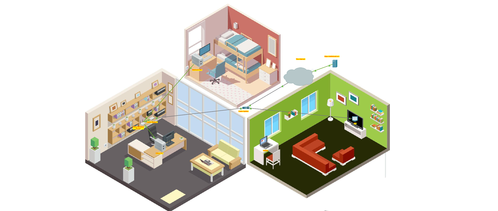

# Configure a Wireless Router and Client — Cisco Packet Tracer

A SOHO home network built and verified in Cisco Packet Tracer: cable-modem internet, a Linksys-style wireless router serving DHCP, wired and wireless clients, and WPA2-secured Wi-Fi. Graded **100% — all assessment items correct.**

> Cisco NetAcad / Skills for All activity: *Configure a Wireless Router and Client*.

---

## Overview

| | |
|---|---|
| **Objective** | Stand up a small home network, secure the wireless LAN, and confirm every client reaches the internet. |
| **Environment** | Cisco Packet Tracer |
| **Router** | Linksys-style Home Wireless Router (web GUI, no CLI) |
| **WAN** | Cable modem → cable splitter → ISP cloud → `skillsforall.srv` |
| **Result** | 100% — every item graded *Correct* |

---

## Topology



**Devices and links**

- **Home Wireless Router** — DHCP server, wireless AP, default gateway. Internet port → **Cable Modem**.
- **Cable Modem / Cable Splitter** — coax path to the ISP; splitter also feeds the **TV**.
- **Bedroom PC** — wired, DHCP client, connected to router **GigabitEthernet 2**.
- **Office PC** — wired, DHCP client, connected to router **GigabitEthernet 1**.
- **Laptop** (living room) — wireless client, WPA2 association to the router.
- **Internet cloud** → **`skillsforall.srv`** — reachability target.

---

## Skills demonstrated

- SOHO wireless router configuration via web GUI
- DHCP server scoping (address pool, max-users limit)
- SSID and radio configuration (2.4 GHz)
- Wireless security: WPA2 Personal (AES) with a passphrase
- Wired client addressing via DHCP
- Wireless client association and end-to-end connectivity testing
- Admin credential management and password recovery (see *Troubleshooting*)

---

## Configuration

### Part 1 — Physical connectivity
Coax from splitter to cable modem and TV; Ethernet from cable modem to the router's Internet port; wired PCs to the router's Gigabit LAN ports.

### Part 2 — Router configuration

**DHCP (Setup → Network Setup)**
- Address pool: `linksysPool`
- **Maximum Number of Users:** `10` — capping the scope limits how many devices can lease an address in a dense-housing scenario.

**Admin (Administration)**
- Changed the default web admin password.
- Login uses **username `admin`** plus the password — both default to `admin` on a factory router.

**Wireless LAN (Wireless)**
- Enabled the **2.4 GHz** radio.
- **SSID:** `MyHome`

**Wireless security (Wireless → Wireless Security)**
- **Mode:** WPA2 Personal (strongest option this router offers)
- **Encryption:** AES
- **Passphrase:** case-sensitive; required for any client to associate.

### Part 3 — IP addressing & connectivity test
Wired PCs pull addresses via DHCP (verified 192.168.x range). The laptop associates to `MyHome` with the WPA2 passphrase, leases an address, and reaches `skillsforall.srv` — confirming DHCP, wireless auth, and WAN routing all work together.

---

## Verification

Packet Tracer's **Check Results → Assessment Items** returned *Correct* on every graded object:

- Router: Password, Max User (linksysPool), Internet port type/link
- Wireless 2.4G: Authentication Type, Encryption Type, Pass Phrase, SSID
- Laptop: wireless link to router, Pass Phrase, SSID
- Bedroom PC / Office PC: DHCP client enabled, correct physical links
- Coaxial Splitter: both coax links and types

**Score: 100%.**

---

## Troubleshooting note — admin credential lockout

Mid-lab, the web GUI rejected the admin login after a password change. Root cause: the login prompt has **two** fields, and the factory default fills *both* with `admin`. Changing the password only updates the password field — the **username stays `admin`**. A field mismatch on the confirm step, or retyping a case-sensitive password, produces an apparent lockout.

**Recovery on a Linksys-style router:** there is no CLI backdoor. Options, in order — (1) reconnect via the DHCP toggle if the session simply dropped, (2) retry `admin` / default password, (3) factory-reset from the router's **Physical** tab, which returns credentials to `admin` / `admin` and requires reconfiguring the router (not the clients or cabling).

**Takeaway:** distinguish a dropped management session from a real credential failure before resetting; know that consumer routers recover through hardware reset, not console.

---

## Files

```
.
├── README.md
├── Configure a Wireless Router and Client.pka   # the Packet Tracer file
└── images/
    └── topology.png                             # topology screenshot
```

To run: open the `.pka` in Cisco Packet Tracer (free via Cisco Skills for All).
